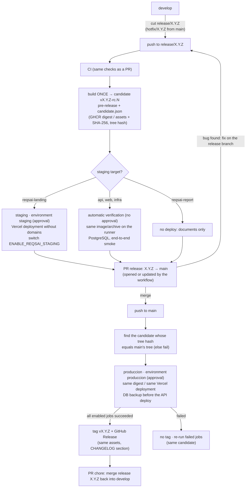

# Contributing to Kntro-Soft / ReqsAI

This is the default contribution guide for every Kntro-Soft repository that has no `CONTRIBUTING.md` of its own
(today `reqsai-landing` and `reqsai-infra`). `reqsai-api`, `reqsai-web` and `reqsai-report` keep their own guide
in `.github/CONTRIBUTING.md`, which follows the same rules and adds the stack-specific details.

## Table of Contents

- [Work management](#work-management)
- [Gitflow](#gitflow)
- [Commits and pull requests](#commits-and-pull-requests)
- [Quality gates](#quality-gates)
- [Traceability](#traceability)
- [Releases and deployment](#releases-and-deployment)
- [Environments and approvals](#environments-and-approvals)
- [Deploy switches](#deploy-switches)
- [Container registry](#container-registry)
- [Reusable workflows](#reusable-workflows)

---

## Work management

All work lives on the [ReqsAI project board](https://github.com/orgs/Kntro-Soft/projects/3), linked to
`reqsai-api`, `reqsai-web`, `reqsai-landing`, `reqsai-infra` and `reqsai-report`.

| Item | Open it with | Notes |
|------|--------------|-------|
| **User Story** | the *User Story* form | As a / I want / so that, plus acceptance criteria (Gherkin scenarios). |
| **Bug** | the *Bug* form | Steps, expected vs actual, and the acceptance criteria that prove the fix. |
| **Task** | the *Task* form | Technical or operational work with verifiable acceptance criteria. |

The forms set the issue type (the board's **Type** field), a label and add the issue to the board. Fields:

| Field | Values |
|-------|--------|
| Status | **Backlog** (created) → **Ready** (refined, criteria agreed) → **In Progress** (branch open) → **In Review** (PR open) → **Testing** (in `develop` or a release branch) → **Done** (released to `produccion` and tagged) |
| Priority | High, Medium, Low |
| Type | User Story, Bug, Task (the organization issue types) |

## Gitflow

| Branch | From | Merges into | Purpose |
|--------|------|-------------|---------|
| `main` | — | — | What runs in production. Every merge deploys an approved candidate, then is tagged. |
| `develop` | `main` | — | Integration branch (not the default branch: `main` is). |
| `feature/<issue>-<slug>` | `develop` | `develop` | User story or task, e.g. `feature/123-export-to-jira`. |
| `bugfix/<issue>-<slug>` | `develop` | `develop` | Bug found before a release, e.g. `bugfix/130-tenant-leak`. |
| `release/X.Y.Z` | `develop` | `main`, then back into `develop` | Stabilization of version X.Y.Z: candidates `X.Y.Z-rc.N` are built and tested here. |
| `hotfix/X.Y.Z` | `main` | `main`, then back into `develop` | Urgent production fix (patch version). |

No other prefixes (`feat/`, `fix/`, `ci/`, `docs/`...) are used for branches.

## Commits and pull requests

- [Conventional Commits](https://www.conventionalcommits.org/en/v1.0.0/) in English:
  `<type>(<scope>): <description>`; reference the issue in the body (`Refs #123`).
- Every pull request targets `develop`; only `release/X.Y.Z` and `hotfix/X.Y.Z` target `main`.
- The description says `Closes #<issue>` so the merge closes the issue and links PR ↔ issue on the board.
- Merge with a merge commit (the rulesets allow nothing else). The merge commit of a release has the same git
  tree as the tested candidate, which is how production finds it.

## Quality gates

`main` and `develop` of every product repository have a ruleset:

- pull request required, **1 approval**, stale approvals dismissed on new pushes, the last push must be approved
  by someone else, conversations resolved;
- no force-push, no deletion;
- required status checks (the CI jobs that run on **every** pull request, never path-filtered ones);
- organization admins may bypass **only through a pull request** (needed while the team cannot always review
  its own changes).

| Repository | Required checks | Recommended extra check on `main` |
|------------|-----------------|-----------------------------------|
| reqsai-api | `Unit tests`, `Integration tests`, `Architecture & build`, `Analyze (Java)` | `Release candidate ready` |
| reqsai-web | `lint-test-build`, `Analyze (JavaScript / TypeScript)` | `Release candidate ready` |
| reqsai-report | `Lint Markdown files` | `Release candidate ready` |
| reqsai-landing | `Lint & build` (once its CI is merged) | `Release candidate ready` |
| reqsai-infra | `Lint` (once its CI is merged) | `Release candidate ready` |

CI runs on pull requests **and** on pushes to `main`, `develop`, `release/**` and `hotfix/**`: the release
pull request and the back-merge are opened by a workflow (`GITHUB_TOKEN`), which starts no `pull_request` run,
so their required checks come from the push of the same commit. `Release candidate ready` is the last job of
`release.yml`; requiring it on `main` means a release pull request can only merge once its head commit is a
verified (or staged) candidate. The old rule "the PR head must be deployed to `produccion`" no longer applies:
production now runs **after** the merge.

## Traceability

```
Issue #123 ─► feature/123-slug ─► commits "Refs #123" ─► PR "Closes #123" → develop
          ─► release/X.Y.Z ─► candidate vX.Y.Z-rc.N (pre-release: commit, tree hash, image digest / SHA-256)
          ─► verification or staging ─► PR "release: X.Y.Z" → main
          ─► produccion (approved, same bytes) ─► tag vX.Y.Z + GitHub Release ─► back-merge PR → develop
```

Each hop is a GitHub link: the issue lists its PRs, the release notes list the PRs, every candidate is a
pre-release whose `candidate.json` records the commit, the git tree hash, the build number, the image digest
or the SHA-256 of each file, and the stage it passed; the final release `vX.Y.Z` points to the `main` commit
that reached production and carries the same `candidate.json`; the environment pages list each deployment.

## Releases and deployment

The organization follows **Gitflow with release candidates, model C + tag at the end**: the artifact is built
once on the release branch, tested there, and the very same bytes go to production after the merge into `main`.
The version is tagged only when production succeeded.



| Repository | Candidate (`release.yml` on `release/**`, `hotfix/**`) | Staging or verification | Production (`produccion.yml` on `main`) | Rollback (`rollback.yml`) |
|------------|--------------------------------------------------------|-------------------------|------------------------------------------|---------------------------|
| reqsai-api | `linux/arm64` image `ghcr.io/kntro-soft/reqsai-api:X.Y.Z-rc.N` (+ `sha-<commit>`), digest in the pre-release | **Verification** (no environment): the digest runs with the prod profile against PostgreSQL + pgvector, every Flyway migration, sign-up → e-mail → sign-in → organization | environment `produccion` (approval) → `reqsai-infra` ships that digest (DB backup first) → digest tagged `X.Y.Z` and `latest` | the digest of `vX.Y.Z` again, approval in `produccion` |
| reqsai-web | `linux/arm64` image `ghcr.io/kntro-soft/reqsai-web:X.Y.Z-rc.N` | **Verification**: nginx image, shell, SPA fallback, bundles, translations | same as the API | same as the API |
| reqsai-landing | `vercel build --prod` output (+ `version.json`) as a pre-release asset | **Staging**: environment `staging` (approval), the output deployed with `--prod --skip-domain` (optional alias) | environment `produccion`: `vercel promote` of that same deployment, `/version.json` checked | `vercel promote` of the release's deployment, or its stored output |
| reqsai-infra | `git archive` of `ansible/` + `compose/` (the whole tree) as a pre-release asset | **Verification**: the archive's Compose stack with the production images (GHCR `latest`, or `develop` before the first release), routes through Caddy, backup and restore | `deploy-mvp.yml`: approval in `produccion`, Ansible over SSM in `mvp` (DB backup first) | `deploy-mvp.yml` with the tag's `ansible/` and `compose/` |
| reqsai-report | PDF, Word and ZIP built once, as pre-release assets | none (no deploy) | the same files published as `vX.Y.Z` | — |

Rules every pipeline enforces:

1. The branch is `release/X.Y.Z` or `hotfix/X.Y.Z` and the version file (`build.gradle.kts`, `package.json` or
   `VERSION`) already says `X.Y.Z`: the first commit of a release is `chore(release): X.Y.Z` (version bump +
   `CHANGELOG.md` section). A published version is never reused; a fix to it is a new version.
2. `N` of `rc.N` is one more than the highest existing `vX.Y.Z-rc.*`; re-running the workflow of a commit reuses
   its candidate. Candidates are never edited away: a new push builds `rc.N+1`.
3. Production refuses a `main` commit whose tree differs from every verified candidate ("main differs from the
   tested candidate; push the change to the release branch to build a new rc").
4. The final tag and release exist only if every enabled production job succeeded. Re-running the failed jobs
   reuses the same candidate.
5. The back-merge `main → develop` is a pull request (`chore: merge release X.Y.Z back into develop`).

Pull requests opened by a workflow need *Allow GitHub Actions to create and approve pull requests* (organization
and repository settings); while it is off, the run prints the compare link and the title to open them by hand.

Database: Flyway migrations only move forward. The API deploy dumps PostgreSQL on the host right before it
changes the stack (`reqsai-backup`, kept with the daily dumps); a rollback that crosses a migration restores that
dump (`reqsai-restore`, section 14.4 of the reqsai-infra deploy guide).

## Environments and approvals

Every environment that receives a deploy has the required reviewer `jhosepmyr` (`prevent_self_review: false`)
and admins cannot bypass it.

| Repository | Environment | Allowed refs | Used by |
|------------|-------------|--------------|---------|
| reqsai-api, reqsai-web | `produccion` | `main` | `produccion.yml` job `deploy`, `rollback.yml` |
| reqsai-landing | `staging` | `release/*`, `hotfix/*` | `release.yml` job `staging` |
| reqsai-landing | `produccion` | `main` | `produccion.yml` job `produccion`, `rollback.yml` |
| reqsai-infra | `produccion` | `main` | `deploy-mvp.yml` job `approve` (called by `produccion.yml` and `rollback.yml`, or run by hand) |
| reqsai-infra | `mvp` (unchanged, no reviewer) | `main` | `deploy-mvp.yml` job `deploy`; its name is part of the AWS role trust (`environment:mvp`) |

A release of reqsai-api or reqsai-web is approved **once**, in the app's `produccion`; `reqsai-infra` sees that
deployment `in_progress` for the same commit and does not ask again.

DEV is each developer's machine and TEST is CI (Testcontainers, Vitest) on every PR. Staging exists only where it
is free (the landing on Vercel). The API and web run on a single EC2 host: their candidates are verified on the
runner instead. A real staging host costs about US$ 18.3/month (second `t4g.small` 24×7 in us-east-1); see
section 14.7 of the
[reqsai-infra deploy guide](https://github.com/Kntro-Soft/reqsai-infra/blob/main/docs/deploy-ec2-docker-compose.md).

## Deploy switches

Every deploy channel has an on/off switch: an **organization variable** in *Kntro-Soft → Settings → Secrets and
variables → Actions → Variables* (one control panel; organization variables reach public repositories on the
Free plan). Only the exact value `true` turns a channel on; unset means off. A job that is switched off is
skipped and the run summary says which variable stopped it. Verification jobs are never switchable.

| Variable | Repository · workflow | Controls |
|----------|-----------------------|----------|
| `ENABLE_REQSAI_API_IMAGE` | reqsai-api · `release.yml` | Building the API candidate image (off: CI only, no candidate) |
| `ENABLE_REQSAI_API_DEPLOY` | reqsai-api · `produccion.yml`, `rollback.yml` | Deploying the API (off: no deploy, no tag) |
| `ENABLE_REQSAI_WEB_IMAGE` | reqsai-web · `release.yml` | Building the web candidate image |
| `ENABLE_REQSAI_WEB_DEPLOY` | reqsai-web · `produccion.yml`, `rollback.yml` | Deploying the web app |
| `ENABLE_REQSAI_INFRA_DEPLOY` | reqsai-infra · `deploy-mvp.yml` | Every deploy to the MVP host (the app deploy jobs fail if it is off) |
| `ENABLE_REQSAI_LANDING_PREVIEW` | reqsai-landing · `release.yml` | Building the landing candidate with the Vercel CLI (needs `VERCEL_TOKEN`) |
| `ENABLE_REQSAI_STAGING` | reqsai-landing · `release.yml` job `staging` | The staging deployment (off: an urgent hotfix goes straight to its PR; production still needs approval) |
| `ENABLE_REQSAI_LANDING_PRODUCCION` | reqsai-landing · `produccion.yml`, `rollback.yml` | Production of the landing |

## Container registry

The app images go to **GHCR** (`ghcr.io/kntro-soft/reqsai-api`, `ghcr.io/kntro-soft/reqsai-web`): candidates are
tagged `X.Y.Z-rc.N` and `sha-<commit>`, and production adds `X.Y.Z` and `latest` **to the same digest**
(`docker buildx imagetools create`, no rebuild). Pushed with the workflow's `GITHUB_TOKEN`, pulled by digest by
`reqsai-infra` with its own `GITHUB_TOKEN`, so no AWS resource or credential changes. The EC2 host still receives
an image archive over SSM and never talks to a registry. ECR was not created; the comparison is in section 14.7
of the reqsai-infra guide.

## Reusable workflows

Each repository keeps its own `release.yml`, `produccion.yml` and `rollback.yml`, and the same
`.github/scripts/candidate.sh` (number, store, verify, find and publish candidates). The API and web workflows
differ only in the app name and their verification script. Following the strategy, nothing is moved to a central
repository yet. Extract a shared workflow (for example `Kntro-Soft/.github/.github/workflows/image-release.yml`
with an `app` input) only when the pattern is proven: at least two releases of each app through these pipelines
without changes to the copies. Until then, a change to `candidate.sh` is applied to every copy in the same
round of pull requests.
